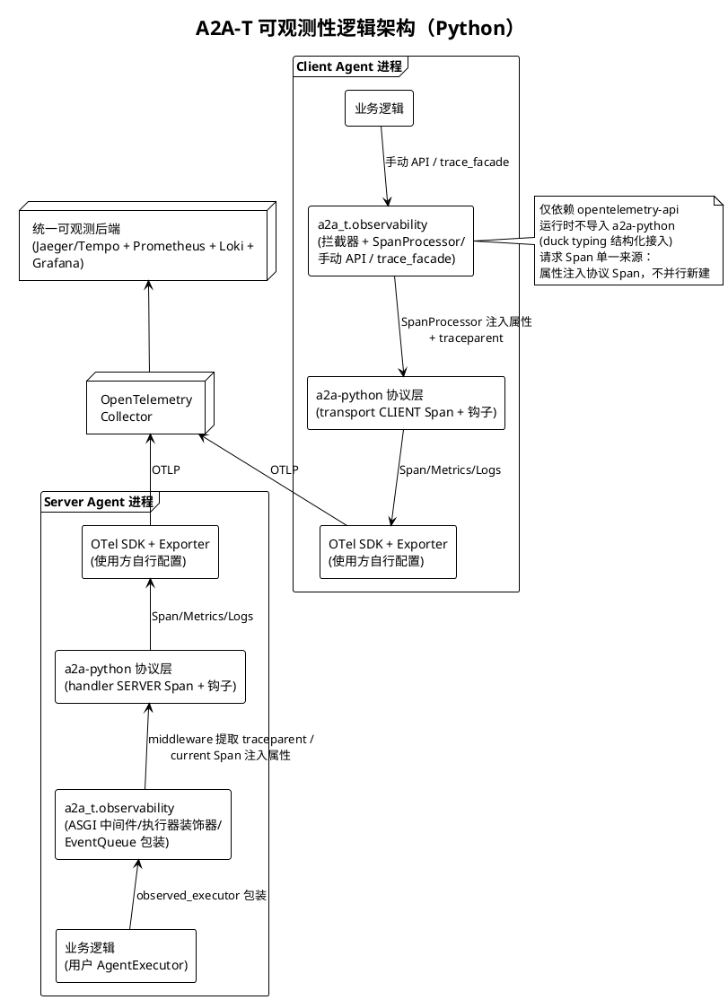

# A2A-T 可观测 SDK 设计文档（Python）

> **版本**: v2.0（架构修订：协议 Span 单一来源 + A2A-T 属性注入）
> **日期**: 2026-09-12
> **定位**: 面向代码开发与 SDK 使用者——定义可观测模块的公开 API、集成方式与使用样例
> **参考大纲**: 仓库根目录 `observity.md`（本文档为其落地设计，偏差见附录 A）
> **图例**: 架构图与调用链图使用 PlantUML

---

## 1. 概述

### 1.1 目标

- **端到端追踪**：Client Agent → Server Agent 的完整调用链在同一 TraceID 下闭环，含 W3C TraceContext（traceparent）传播、SSE per-event Span
- **A2A-T 语义可查**：**协议层 Span（a2a-python `@trace_class` 创建的 transport CLIENT Span 与 handler SERVER Span）注入 A2A-T 扩展属性**（`extension.name`、`negotiation.*`、`task.*` 等），可按业务语义过滤聚合
- **Span 单一来源**：请求级 Span 仅由协议层创建；A2A-T 仅创建协议层缺失的 **per-event 扩展 Span**（协议事件的细粒度追踪，属协议扩展性质）；使用方自建 Span 走 SDK 手动 API，不强制不约束
- **协作可量化**：L1/L2/L3 指标（OTel GenAI SemConv 对齐 + A2A-T 扩展）
- **报文可追溯**：关键协议报文 Payload 自动结构化日志（截断/脱敏可控）
- **SDK 内部可追踪**：opt-in 的门面方法 L4 Span（`trace_facade`，不改源码、不强注入）
- **可端到端验证**：随 SDK 提供可离线运行的端到端样例与自动化验证测试（§10）

### 1.2 非目标

- 不含 L4 指标（`a2at.task.prompt.generation.duration` / `compliance.check.duration` 等均不做）
- 不自动埋点 `A2ATClient` / `A2ATServer` 门面——仅用户显式调用 `trace_facade()` 才启用
- 不封装公开日志 API（复用 stdlib `logging` + OTel `LoggingHandler`，见 §5.4）
- 不引入 OTel SDK / Exporter 实现——仅依赖 `opentelemetry-api`
- 不代管业务状态（Authorization 下发→使用的 Span 引用由使用方保存）
- 不修改 a2a-python 源码；**运行时不导入 a2a-python**
- **不自行创建请求级 Span**（不并行 `a2at.client.send_message` / `a2at.server.execute` 之类与协议 Span 重复的 Span）

### 1.3 硬约束

| 约束 | 说明 |
|------|------|
| 依赖隔离 | `a2a_t.observability` 运行时永不 import a2a-python；仅 `TYPE_CHECKING` 下引用其类型。使用方自行同时引入 `a2a-python` + `a2a-t-sdk`，两者均为使用方的直接依赖 |
| OTel 依赖 | 仅 `opentelemetry-api`，经 extra 引入：`pip install a2a-t-sdk[observability]`；未安装时 NoOp 降级 |
| 结构化接入 | 适配器对 a2a-python 的扩展点采用 duck typing（结构化协议），不依赖 isinstance/import |
| 总开关 | 环境变量 `OTEL_INSTRUMENTATION_A2AT_SDK_ENABLED`（默认 `true`，参考 a2a-python `OTEL_INSTRUMENTATION_A2A_SDK_ENABLED` 模式） |
| Span 单一来源 | **请求级 Span 仅由协议层创建**；A2A-T 向协议 Span **注入属性**（SpanProcessor / current Span 写入），不并行新建请求 Span；A2A-T 自建的 Span 仅限 per-event 扩展（`a2at.event.*`）与使用方手动创建（`A2ATSpan` / `trace_facade`） |
| 属性注入纪律 | A2A-T 属性**注入协议层 Span**（transport CLIENT Span、handler SERVER Span）；注入对无 A2A-T 语义的调用（普通 A2A 请求）自然跳过（无扩展 URI / 无 negotiationContext 则不写） |

---

## 2. 总体架构与模块结构

### 2.1 模块结构

```
src/a2a_t/observability/
├── __init__.py          # 公共 API 总出口（懒加载，模式同 a2a_t/__init__.py）
├── _otel_compat.py      # OTel try/except 导入 + NoOp 降级 + 总开关
├── attributes.py        # 属性名常量 + a2at_attribute_extractor（报文→属性提取）
├── config.py            # A2ATObservabilityConfig
├── span.py              # A2ATSpan：手动 Span API（context manager）
├── metrics.py           # A2ATMetricsRecorder：L1/L2/L3 指标记录器
├── logs.py              # 内部自动报文日志实现（截断/脱敏/开关）
├── propagation.py       # W3C TraceContext 注入/提取（traceparent）
├── sdk_trace.py         # trace_facade(obj)：门面 L4 Span 追踪（opt-in）
├── client/
│   ├── __init__.py
│   ├── interceptor.py   # A2ATClientInterceptor（结构化实现 Client 拦截器协议）
│   └── span_processor.py # A2ATClientSpanProcessor（协议 transport Span 属性注入桥）
└── server/
    ├── __init__.py
    ├── middleware.py    # A2ATTraceContextMiddleware（纯 ASGI，提取+激活 traceparent，零新增 Span）
    ├── executor.py      # A2ATAgentExecutorDecorator + observed_executor() 工厂
    └── event_queue.py   # A2ATEventQueueDecorator（结构化包装 EventQueue）
```

### 2.2 依赖与分发

- `pyproject.toml` 主依赖不变，新增 extra：

```toml
[project.optional-dependencies]
observability = ["opentelemetry-api>=1.33.0"]
```

- dev 依赖新增：`opentelemetry-sdk`（测试用 InMemorySpanExporter / InMemoryMetricsReader）；`a2a-sdk` 仅集成测试组与样例需要
- OTel SDK + OTLP Exporter 由使用者自行配置（标准样例见 §5.0；Client 侧属性注入依赖 TracerProvider 支持 `add_span_processor`，真实部署必然满足——无 OTel SDK 则无导出）

### 2.3 协议层 Span 与 A2A-T 的关系（核心机制）

**协议层 Span 分布**（已针对 a2a-sdk 1.1.0 验证）：

| 侧 | 协议 Span | 创建者 | 关键事实 |
|----|----------|--------|---------|
| Client | transport CLIENT Span（`a2a.client.transports.rest.RestTransport.*` 等，`@trace_class(kind=CLIENT)`） | a2a-python | 拦截器 `before()` 时**尚未创建**、`after()` 时**已结束**；流式方法（async generator）的 Span 在生成器创建即结束（"退化"Span，SpanContext 仍有效） |
| Server | handler SERVER Span（`DefaultRequestHandler.*`，`@trace_class(kind=SERVER)`） | a2a-python | **executor.execute() 执行期间是 current Span**（`start_as_current_span` 包裹方法体） |

**A2A-T 注入机制**（两侧不同，由时序事实决定）：

| 侧 | 机制 | 说明 |
|----|------|------|
| Client | **SpanProcessor + ContextVar 桥** | `before()` 将提取的属性 / `service_parameters` 引用 / 起始时间戳存入 ContextVar；`A2ATClientSpanProcessor`（拦截器初始化时幂等注册，按 instrumentation scope `a2a-python-sdk` + SpanKind=CLIENT 过滤）在 transport Span `on_start` 时：① 写入 A2A-T 属性；② 将该 Span 上下文作为 traceparent 注入 stash 的 `service_parameters`（时序成立：`on_start` 先于 transport 方法体构建 HTTP headers）；③ 回存 SpanContext 供事件 Span 挂靠 |
| Server | **current Span 直接写入** | 执行器装饰器 `execute()` 内 `trace.get_current_span()` 即协议 SERVER Span → 写入 A2A-T 属性；捕获其 SpanContext 传给 EventQueue 包装 |

**跨 Agent traceparent 连续性**（Server 侧提取必须在协议 SERVER Span 创建之前 → HTTP 边界）：

| 方式 | 新增 Span | 说明 |
|------|----------|------|
| `A2ATTraceContextMiddleware`（本模块提供，推荐） | 无 | 纯 ASGI 中间件：提取 traceparent → `context.attach` 激活 → 后续协议 SERVER Span 自然成为 Client Span 子节点；同一 async task 内 contextvars 传播 |
| 使用方已有 `opentelemetry-instrumentation-asgi` | http.server Span | ASGI 自动插桩已做提取激活，本模块中间件无需叠加 |
| 两者皆无 | — | 协议 SERVER Span 降级为本地 trace 根（属性注入与 per-event Span 不受影响），集成 WARNING 提示 |

**A2A-T 自建 Span 仅限两类**（"协议扩展"性质，不与协议 Span 重复）：

1. per-event 扩展 Span（`a2at.event.*`）：Server 侧 INTERNAL（父=协议 SERVER Span）、Client 侧 CLIENT（父=协议 transport Span，显式 context 挂靠回存的 SpanContext）
2. 使用方手动创建（`A2ATSpan` / `trace_facade`）——不强制、不约束

### 2.4 接入的钩子点（全部为 a2a-python 公开扩展点 / OTel 标准扩展点，已验证）

| 侧 | 钩子 | 用法 |
|----|------|------|
| Client | `ClientFactory.create(card, interceptors=[...])` / `Client.add_interceptor(...)` | 注入 `A2ATClientInterceptor` |
| Client | `ClientCallInterceptor.before(BeforeArgs)` / `after(AfterArgs)` | before：提取 A2A-T 属性入 ContextVar + 注册 SpanProcessor（幂等）；after：每事件创建 per-event Span（父=transport Span）/ 单次（非流式） |
| Client | OTel `TracerProvider.add_span_processor` | `A2ATClientSpanProcessor` 向协议 transport Span 注入属性 + 注入 traceparent（OTel 标准富化机制） |
| Server | ASGI middleware（Starlette `Middleware` / FastAPI `add_middleware`） | `A2ATTraceContextMiddleware`：HTTP 边界提取 + 激活 traceparent（零新增 Span） |
| Server | `AgentExecutor.execute(context, event_queue)` | `A2ATAgentExecutorDecorator` 包装用户 executor：向 current 协议 SERVER Span 注入属性；包装 EventQueue |
| Server | `EventQueue.enqueue_event(event)` | `A2ATEventQueueDecorator` 包装，实现 Server 侧 per-event Span |
| 协议 | `@trace_function(attribute_extractor=...)` | 用户自有函数叠加 A2A-T 属性（可选） |

结构化协议（duck typing）说明：a2a-python 的 `BaseClient` / `DefaultRequestHandler` 调用钩子时不做 isinstance 检查，仅按名称调用方法。适配器收到的 a2a 对象作为运行时参数按结构访问（`.message.metadata`、`.call_context.state` 等），无需 import。适配器访问的**精确字段路径清单见附录 B**（结构化访问映射）——该清单同时是 §9 stub 测试的依据与 a2a-python 升级的兼容性契约。本设计中的钩子行为已针对 **a2a-sdk 1.1.0** 验证。

### 2.5 逻辑架构



---

## 3. 公开 API 清单

### 3.1 公共导出（`a2a_t.observability`）

`A2ATSpan`、`a2at_attribute_extractor`、`trace_facade`、`A2ATMetricsRecorder`、`inject_traceparent`、`extract_trace_context`、`A2ATClientInterceptor`、`A2ATTraceContextMiddleware`、`A2ATAgentExecutorDecorator`、`observed_executor()`、`A2ATEventQueueDecorator`、`A2ATObservabilityConfig`、全部属性名常量。（`A2ATClientSpanProcessor` 为内部实现细节，不导出）

### 3.2 Trace 属性全景

属性值为 OTel 标量类型（str/int/bool）。属性名常量从 `a2a_t.observability` 导出；扩展 URI 常量**直接复用** `a2a_t.core.metadata` 中的定义（`TASK_T_EXTENSION_URI` 等，含 NL 旧别名），不在 observability 模块内复制，避免漂移。

**属性注入目标**：Client 侧 → 协议 transport CLIENT Span（SpanProcessor `on_start` 写入）；Server 侧 → 协议 handler SERVER Span（current Span 写入）；per-event 属性 → A2A-T per-event Span；手动补充 → 使用方自建 Span（`A2ATSpan` 等）。

| 层级 | 属性 | 取值来源 | 提取方式 |
|------|------|---------|---------|
| OTel SemConv | `gen_ai.operation.name` | a2a 方法名（send_message / execute / subscribe / push-config-*） | 自动 |
| OTel SemConv | `gen_ai.conversation.id` | `message.context_id` | 自动 |
| A2A-T | `extension.name` | metadata 中的 TMF 扩展 URI key 或 `A2A-Extensions` header → `Task-T` / `Negotiation-T`（含 `Negotiation-T/NL/v1` 旧别名，运行时兼容读取）/ `Notification-T`（含 NL 别名）/ `Authorization-T` | 自动 |
| A2A-T | `task.id` / `task.status` | `message.task_id`；TaskStatusUpdateEvent.status.state | 自动 |
| A2A-T | `task.type` | 业务语义分类 | `task_type_provider` 回调 / `apply_task_type()` |
| A2A-T | `negotiation.id` / `negotiation.round` / `negotiation.max_rounds` / `negotiation.performative` | metadata 的 `negotiationContext{id, round, maxRounds, performative}` | 自动 |
| A2A-T | `negotiation.total_rounds` | 终结消息（performative=ACCEPT/REJECT/ABORT）时的 round 值 | 自动（终结时）/ `apply_negotiation_total_rounds()` |
| A2A-T | `notification.topic` | 业务订阅主题（报文承载渲染后 prompt 文本，无法从 wire 自动解析） | `notification_topic_provider` 回调 / `apply_notification_topic()` |
| A2A-T | `authorization.policy.id` / `operation_type` / `operation_risk_level` | 下发方持有的结构化数据（渲染前） | `authorization_provider` 回调 / `apply_authorization()` |
| A2A-T | `streaming.event.kind` | 事件结构分发（见 §7.2）——仅注入 per-event Span | 自动 |
| A2A-T | `push.notification.url` | push notification config 请求参数 | 自动 |

> **与 observity.md §8 的偏差**：Authorization-T 报文在 wire 上承载**渲染后的 prompt 文本**（`metadata[扩展URI]=promptText`），非结构化字段，故 `authorization.*` 不能从报文自动提取，改由 provider 回调/手动 API 补充；`negotiation.max_rounds`、`negotiation.performative` 为本 SDK 报文实际携带、大纲未列但可自动获得的补充属性。
>
> **L4 门面 Span 无自定义属性**：`trace_facade` 产生的 Span 信息由 Span 名称（`a2at.sdk.client.<method>`）与原生 Span 状态（OK/ERROR、record_exception）承载。

### 3.3 Span API

**请求级 Span**：由 a2a-python 协议层创建（transport CLIENT Span / handler SERVER Span），A2A-T 仅注入属性（机制见 §2.3），无请求级 Span API。

**手动 Span**（context manager，OTel 缺失时全部方法 NoOp 吸收；供使用方自建 Span，不强制不约束）：

```python
class A2ATSpan:
    def __init__(self, name: str, *, kind: str = "INTERNAL",
                 attributes: Mapping[str, str | int | bool] | None = None,
                 context: object | None = None) -> None
    # kind 取值: "INTERNAL" | "CLIENT" | "SERVER" | "PRODUCER" | "CONSUMER"（映射 OTel SpanKind）
    # context: 接受 extract_trace_context() 返回的不透明 Context 作为显式父——
    #          手动 Server 侧埋点（不经执行器装饰器）时的跨 Agent 父子关联入口
    def __enter__(self) -> A2ATSpan
    def __exit__(self, exc_type, exc_val, exc_tb) -> None   # 成功→OK；异常→ERROR+record_exception
    def set_attribute(self, key: str, value: str | int | bool) -> None
    # 手动补充类方法：
    def apply_task_type(self, task_type: str) -> None
    def apply_negotiation_total_rounds(self, total_rounds: int) -> None
    def apply_notification_topic(self, topic: str) -> None
    def apply_authorization(self, *, policy_id: str, operation_type: str,
                            risk_level: str) -> None
    def add_link(self, other: A2ATSpan) -> None              # 异步场景 Span 关联
```

**属性提取器**（供用户在自己函数上叠加 A2A-T 属性；签名由 a2a-python `@trace_function` 约定）：

```python
def a2at_attribute_extractor(span, args, kwargs, result, exception) -> None
# 结构化遍历 args/result：识别 .message.metadata / .metadata / .call_context.state['headers'] /
# 事件对象（.task_id/.status.state/artifact）等形态，将自动属性写入 span
# 写入目标 span 可以是协议 Span，也可以是用户自建 Span
```

**SDK 门面追踪**（opt-in，实例级包装、不改类定义与源码、不强注入）：

```python
def trace_facade(obj: Any, *, role: str | None = None,
                 methods: Iterable[str] | None = None) -> Any
# 遍历 type(obj) 公共方法，在实例上 setattr 包装（functools.wraps 保留签名）
# Span: a2at.sdk.{role}.{method}，INTERNAL，无自定义属性
# role 缺省按类型名字符串猜测（类名含 "Client"→client，含 "Server"→server，否则 "custom"），
# 不 import a2a_t.client/a2a_t.server
# 异步语义：inspect.iscoroutinefunction 检测——协程方法以 async 包装器 await 后再结束 Span，
# 同步方法以普通包装器结束，保证 Span 覆盖真实执行期
```

### 3.4 Metrics API

| 层级 | 指标 | 类型 | 单位 | 记录方 |
|------|------|------|------|--------|
| L1 | `gen_ai.client.operation.duration` | Histogram | s | Client 拦截器自动（与 L3 同一样本双写）+ 手动 |
| L2 | `gen_ai.client.token.usage` | Histogram | {token} | 仅手动（协议层无 token 信息） |
| L3 | `a2at.task.request.duration` | Histogram | s | Client 拦截器（流全耗时）/ Server 执行器装饰器（execute 耗时）自动 + 手动 |
| L3 | `a2at.negotiation.total_rounds` | Counter | 1 | **仅 Client 拦截器**在终结消息经过时自动记录（Server 侧不记，避免双端重复计数）+ 手动 |

**自动记录样本的属性集**（防止双端样本混入同一总体）：

| 指标 | 自动记录属性 |
|------|-------------|
| `gen_ai.client.operation.duration` | `gen_ai.operation.name`、`extension.name`、`a2at.span.side=client` |
| `a2at.task.request.duration` | `gen_ai.operation.name`、`extension.name`、`a2at.span.side`（`client`/`server`）、`streaming`（true/false，是否流式） |
| `a2at.negotiation.total_rounds` | `negotiation.id`、`outcome`（accept/reject/abort）、`extension.name` |

> `a2at.span.side` 属性是双端归因维度：Client 拦截器与 Server 执行器装饰器都会记录 `a2at.task.request.duration`（语义不同：流全耗时 vs execute 耗时），后端按 side 维度区分，不混入同一总体。`a2at.negotiation.total_rounds` 因终结消息同时流经两端，**仅 Client 侧记录**。

```python
class A2ATMetricsRecorder:   # 链式，方法均返回 self；无参构造，内部从全局 MeterProvider 获取 meter，可全局复用
    def task_request_duration(self, duration_s: float, *, attributes=None) -> Self
    def gen_ai_operation_duration(self, duration_s: float, *, operation: str, attributes=None) -> Self
    def gen_ai_token_usage(self, tokens: int, *, token_type: str = "input", attributes=None) -> Self
    def negotiation_total_rounds(self, rounds: int, *, negotiation_id: str,
                                 outcome: str, attributes=None) -> Self   # outcome: accept/reject/abort
```

Meter 与 Tracer 的 instrumentation scope 名称均为 `a2at-observability`（`opentelemetry-api` 的 `metrics.get_meter` / `trace.get_tracer`；未装 OTel 时为 NoOp）。

### 3.5 传播 API

```python
TRACEPARENT_HEADER: str = "traceparent"
def inject_traceparent(headers: MutableMapping[str, str]) -> None    # 当前上下文 → headers
def extract_trace_context(headers: Mapping[str, str]) -> object | None  # headers → 不透明 Context
```

基于 `opentelemetry-api` 自带 W3C TraceContext 传播器封装，无新增依赖。

### 3.6 配置

```python
@dataclass
class A2ATObservabilityConfig:
    task_type_provider: Callable[[Mapping[str, Any]], str | None] | None = None
    notification_topic_provider: Callable[[Mapping[str, Any]], str | None] | None = None
    authorization_provider: Callable[[Mapping[str, Any]], Mapping[str, str] | None] | None = None
    payload_log_enabled: bool = False       # env A2AT_LOGS_PAYLOAD_ENABLED 覆盖
    payload_log_max_length: int = 4096      # env A2AT_LOGS_PAYLOAD_MAX_LENGTH 覆盖
    payload_redactor: Callable[[str], str] | None = None
    record_metrics: bool = True
```

Provider 回调统一收到"已提取的 metadata 视图"（消息 metadata + headers 的合并 Mapping），返回属性值或 None（省略属性）。`authorization_provider` 返回 Mapping 的键为 `policy_id` / `operation_type` / `risk_level`（与 `apply_authorization()` 参数名对齐），缺失键省略对应属性。回调抛异常 → 吞掉 + WARNING，属性省略，不影响业务流。

配置优先级：**显式构造参数 > 环境变量 > 默认值**（环境变量仅在构造参数未显式传入时生效）。`record_metrics` 仅经构造参数控制，无环境变量。

**Provider 调用点**（各组件在哪个钩子调用哪个 provider）：

| Provider | Client 拦截器 | Server 执行器装饰器 |
|----------|--------------|-------------------|
| `task_type_provider` | `before()`（基于请求 metadata 视图） | `execute()` 入口（基于 RequestContext metadata 视图） |
| `notification_topic_provider` | `before()` | `execute()` 入口 |
| `authorization_provider` | `before()`（下发方持有结构化数据） | 不调用（Server 无法解析渲染后文本） |

### 3.7 日志（无公开 API）

**不封装公开日志 API**：OTel Python 的日志路径本就是 stdlib `logging` + `opentelemetry-sdk` 的 `LoggingHandler` 桥接——handler 自动把当前 Span 的 trace_id/span_id 附加到日志记录并经 OTLP 上报，三信号关联是现成能力。

- **自动报文日志（模块内部实现）**：拦截器/执行器装饰器在关键节点自动输出结构化日志（logger 名 `a2at.observability`），截断/脱敏/开关作为内部代码，仅经 `A2ATObservabilityConfig` 暴露配置
- **手动日志（无 API）**：文档给出使用方直接用 `logging.getLogger(...)` + `LoggingHandler` 的标准样例，并附字段命名约定（与自动日志字段一致、可检索）

自动日志事件约定（**仅含钩子可达数据**；各事件由标注组件输出）：

| 事件名 | 输出组件 | 级别 | 核心字段 |
|--------|---------|------|---------|
| `task.request` | Client 拦截器 `before()` / 执行器装饰器 `execute()` 入口 | DEBUG | extension.name, payload, task.id（存在时；Client 发起时尚无 task_id 则省略） |
| `task.status_changed` | 两端（拦截器 `after()` / EventQueue 包装） | INFO | task.id, task.status |
| `task.artifact` | 两端（同上） | INFO | task.id, artifact.name |
| `negotiation.message` | 两端（before/execute 入口） | DEBUG | negotiation.id/round/performative, payload |
| `authorization.delivery` | 执行器装饰器 `execute()` 入口（Authorization-T 报文到达时） | INFO | policy.id, operation_type, risk_level（均来自 provider；无 provider 时仅 extension.name） |
| `notification.subscription` | 执行器装饰器 `execute()` 入口（Notification-T 报文到达时） | INFO | topic（provider 提供） |

> **超出钩子能力的事件转手动日志**：`notification.push`（推送投递，发生在 a2a-python push sender，本模块无钩子可观测——投递结果属业务侧，由使用方手动 `logging` 记录）与 `authorization.delivery` 的存储 `result` 字段（存储结果在用户 executor 业务逻辑内，装饰器不可见——由使用方在 executor 内手动记录）。

---

## 4. 集成方式总览

| 方式 | 接入点 | 适用 | 场景 |
|------|--------|------|:---:|
| Client 拦截器 | `ClientFactory.create(card, interceptors=[A2ATClientInterceptor(...)])` 或 `client.add_interceptor(...)` | Client 侧协议 Span 属性注入 + traceparent 注入 + per-event Span + L1/L3 指标 | 1、2 |
| ASGI 中间件 | `Middleware(A2ATTraceContextMiddleware)`（Starlette）或等价挂接 | Server 侧 HTTP 边界 traceparent 提取激活（跨 Agent 连续性前提） | 1、2 |
| 执行器装饰器 | `observed_executor(my_executor, config=A2ATObservabilityConfig(...))` | Server 侧协议 SERVER Span 属性注入 + 自动 EventQueue 包装 + L3 指标 | 1、2 |
| 门面追踪 | `trace_facade(A2ATClient(...))` / `trace_facade(A2ATServer(...))` | SDK 内部 L4 Span（opt-in，不改源码） | 2（可选） |
| attribute_extractor | 用户自装饰 `@trace_function(attribute_extractor=a2at_attribute_extractor)` | 用户自有函数叠加 A2A-T 属性 | 1、2（可选） |
| 手动 API | `A2ATSpan`（含 `context=` 接收 `extract_trace_context()` 结果）/ `A2ATMetricsRecorder` / `inject_traceparent` / `extract_trace_context` | 精细控制、编排根 Span、异步关联（add_link）——使用方自建 Span，不强制不约束 | 1、2（可选） |

---

## 5. 使用样例

### 5.0 前置条件

```bash
pip install a2a-sdk "a2a-t-sdk[observability]"
pip install opentelemetry-sdk opentelemetry-exporter-otlp   # 使用方自行配置 Exporter
```

OTel SDK 初始化（使用方应用启动时一次，标准 OTel 写法）：

```python
from opentelemetry import trace, metrics
from opentelemetry.sdk.trace import TracerProvider
from opentelemetry.sdk.trace.export import BatchSpanProcessor
from opentelemetry.sdk.metrics import MeterProvider
from opentelemetry.exporter.otlp.proto.grpc.trace_exporter import OTLPSpanExporter
from opentelemetry.exporter.otlp.proto.grpc.metric_exporter import OTLPMetricExporter

trace.set_tracer_provider(TracerProvider())
trace.get_tracer_provider().add_span_processor(
    BatchSpanProcessor(OTLPSpanExporter()))          # OTEL_EXPORTER_OTLP_ENDPOINT 生效
metrics.set_meter_provider(MeterProvider(
    metric_readers=[OTLPMetricExporter()]))
```

### 5.1 场景 1：仅可观测 SDK + 原生 a2a-python

使用方不使用 A2A-T 模板生成/校验，仅用可观测 SDK 感知 Agent 间交互。

**Client 侧**：

```python
from a2a_t.observability import A2ATClientInterceptor, A2ATObservabilityConfig

config = A2ATObservabilityConfig(task_type_provider=lambda md: "配置下发")
client = client_factory.create(card, interceptors=[A2ATClientInterceptor(config=config)])
# 之后正常使用 client.send_message(...) —— 全部自动追踪
```

**Server 侧**（在现有 a2a-python 服务端组装中包一层 + 挂中间件）：

```python
from starlette.applications import Starlette
from starlette.middleware import Middleware
from a2a_t.observability import A2ATTraceContextMiddleware, observed_executor, A2ATObservabilityConfig

server_config = A2ATObservabilityConfig(notification_topic_provider=my_topic_provider)
handler = DefaultRequestHandler(
    agent_executor=observed_executor(MyAgentExecutor(), config=server_config),  # 改动 1
    task_store=InMemoryTaskStore(), agent_card=card)
app = Starlette(
    routes=[*create_agent_card_routes(card), *create_rest_routes(handler)],
    middleware=[Middleware(A2ATTraceContextMiddleware)])   # 改动 2：跨 Agent trace 连续性
```

`observed_executor(executor, *, config: A2ATObservabilityConfig | None = None)` 是 `A2ATAgentExecutorDecorator` 的工厂函数（等价 `A2ATAgentExecutorDecorator(executor, config=config)`）。`A2ATClientInterceptor` 构造签名同为 `A2ATClientInterceptor(*, config: A2ATObservabilityConfig | None = None)`——初始化时幂等注册 `A2ATClientSpanProcessor`（重复构造/多个拦截器实例只注册一次）。

特征：traceparent 传播（中间件提取激活）、协议 Span 属性注入、per-event Span、L1/L3 指标、自动报文日志全部生效；A2A-T 属性按报文实际内容提取（若使用方未按 A2A-T 约定填 metadata，则仅 `gen_ai.*`、`task.id` 等协议层属性可用，业务属性经 provider 补充）。

**用户 AgentExecutor 内获取当前协议 SERVER Span**（协议层已以 start_as_current_span 激活）：

```python
class MyAgentExecutor(AgentExecutor):
    async def execute(self, context: RequestContext, event_queue: EventQueue) -> None:
        # 协议 SERVER Span 在 execute() 期间是 current Span（a2a-python @trace_class 保证），
        # 且已被执行器装饰器注入 A2A-T 属性：
        # 1) 无感——用户代码内一切自动插桩（LLM/HTTP）与手动 A2ATSpan 自然成为其子节点
        # 2) 显式——原始 header: context.call_context.state["headers"]["traceparent"]
        # 3) 句柄——装饰器将协议 SERVER Span 的 SpanContext 放入
        #    context.call_context.state["a2at.span_context"]（供显式挂靠/属性补充）
        ...
```

### 5.2 场景 2：a2a-python + 模板生成/校验（完整 A2A-T 客户端/服务端）

协议层接入与场景 1 完全相同（拦截器 + observed_executor），另加 opt-in 门面追踪：

```python
from a2a_t.client.a2at_client import A2ATClient
from a2a_t.server.a2at_server import A2ATServer
from a2a_t.observability import trace_facade

prompt_client = trace_facade(A2ATClient(env_path=env_path))    # L4 Span，opt-in
a2at_server   = trace_facade(A2ATServer(env_path=env_path))
```

特征：

- **属性提取最大化**：`A2ATClient` 生成的报文自带 `metadata[扩展URI]`、`templateUri`、`negotiationContext{id,round,maxRounds,performative}`——拦截器/执行器装饰器自动提取 `extension.name`、`negotiation.*`、`task.id/status`，无需 provider
- 协商终结消息（performative=ACCEPT/REJECT/ABORT）自动记 `negotiation.total_rounds` 指标（仅 Client 拦截器记录）
- `trace_facade` 覆盖 `generate_task_prompt`、`check_task_prompt`、`validate_*`、协商 12 方法，Span 名称 `a2at.sdk.client.<method>` / `a2at.sdk.server.<method>`，无自定义属性，结果经原生 Span 状态表达
- 用户业务对象（协商编排器等）同样可用 `trace_facade` 或手动 `A2ATSpan` 获得一致追踪

### 5.3 手动 API 样例（协商编排根 Span，模式 B）

```python
from a2a_t.observability import A2ATSpan

with A2ATSpan("negotiation-orchestrate") as root:
    root.apply_negotiation_total_rounds(3)          # 预估轮数，可后补
    for round_no in range(1, 4):
        async for event in client.send_message(build_round_request(round_no)):
            ...   # 协议 transport Span 与 per-event Span 自然成为 root 的后代
```

### 5.4 手动日志样例（标准 logging + OTel Handler）

```python
import logging
logger = logging.getLogger("myapp.agent")   # OTel LoggingHandler 由使用方按标准文档挂接

# 字段命名约定（与自动日志一致）：task.id / negotiation.id / extension.name ...
logger.info("handling task", extra={"task.id": task_id, "extension.name": "Task-T"})
```

---

## 6. 端到端调用链与数据流

### 6.1 Task-T 流式任务（典型闭环）

```
OSS Agent (Client)                              EMS Agent (Server)
─────────────────                              ─────────────────
拦截器 before(): 提取 A2A-T 属性入 ContextVar
  │ SpanProcessor on_start():
  │  ① 属性写入协议 transport Span
  │  ② traceparent 注入 service_parameters
  ▼
[CLIENT] RestTransport.send_message  ← 协议 Span + A2A-T 属性
  ├ gen_ai.operation.name=send_message
  ├ extension.name=Task-T, task.id=...
  │      ▼──────────── HTTP (traceparent) ─────▶ ASGI 中间件提取+激活
  │                                            [SERVER] DefaultRequestHandler.on_message_send
  │                                            ← 协议 Span（父=Client Span，经 traceparent）
  │                                            执行器装饰器注入 A2A-T 属性:
  │                                            extension.name=Task-T, task.id=...
  │                                            ├ [INTERNAL] a2at.event.status    ← 每个 enqueue_event
  │                                            ├ [INTERNAL] a2at.event.artifact  ←  (父=协议 SERVER Span)
  │                                            └ [INTERNAL] a2at.event.completed ←
  │ ◀──────────── SSE 事件 ────────────────────┘
  ├ [CLIENT] a2at.event.status     ← after() 每事件创建
  ├ [CLIENT] a2at.event.artifact      (父=协议 transport Span，显式 context)
  └ [CLIENT] a2at.event.completed
  终止事件 → 记录 L1/L3 指标（时间戳差，无需自建请求 Span）
```

**Trace 树形结构**（请求级 Span 全部来自协议层）：

```
CLIENT: RestTransport.send_message (OSS)          ← 协议 Span（A2A-T 属性已注入）
├── SERVER: DefaultRequestHandler.on_message_send (EMS)   ← 协议 Span（A2A-T 属性已注入）
│   ├── INTERNAL: a2at.event.status (task.status=submitted)   ← A2A-T per-event
│   ├── INTERNAL: a2at.event.status (task.status=working)     ← A2A-T per-event
│   ├── INTERNAL: a2at.event.artifact                          ← A2A-T per-event
│   └── INTERNAL: a2at.event.completed                         ← A2A-T per-event
├── CLIENT: a2at.event.status (OSS)               ← A2A-T per-event
├── CLIENT: a2at.event.artifact (OSS)             ← A2A-T per-event
└── CLIENT: a2at.event.completed (OSS)            ← A2A-T per-event
```

### 6.2 Span 生命周期规则

| Span | 归属 | 创建者 | 结束点 | 父/关联 |
|------|------|--------|--------|---------|
| 协议 transport CLIENT Span | 协议层 | `@trace_class`（transport 方法内） | 协议层自行管理（非流式：方法返回；流式：生成器创建即结束——"退化"Span，SpanContext 仍可用于挂靠） | ambient |
| 协议 handler SERVER Span | 协议层 | `@trace_class`（handler 方法内） | 协议层自行管理（方法返回） | 经 ASGI 中间件激活的 traceparent |
| CLIENT per-event Span | A2A-T 扩展 | 拦截器 `after()` 每事件 | 同步结束 | 显式 = 协议 transport Span 的 SpanContext（SpanProcessor 回存） |
| SERVER INTERNAL per-event Span | A2A-T 扩展 | EventQueue 包装 `enqueue_event()` | 同步结束 | 显式 = 协议 SERVER Span 的 SpanContext（装饰器捕获；execute 返回后仍可挂） |
| L4 门面 Span | 使用方手动 | `trace_facade` 包装方法入口 | 方法返回/异常（finally；协程方法 await 后） | ambient（用户调用点） |

**请求 Span 生命周期由协议层全权管理**——A2A-T 无请求 Span，不存在泄漏/兜底结束问题；ContextVar stash 随 async 任务结束自然回收。L1/L3 指标经时间戳差计算（before 记起始，终止事件/after 记结束），不依赖 Span 生命周期。

### 6.3 协商多轮（Negotiation-T）

- **模式 A（无根 Span）**：每轮独立 trace，靠 `negotiation.id` 属性在后端聚合还原（`WHERE negotiation.id=N001 ORDER BY negotiation.round`）
- **模式 B（有根 Span）**：用户在编排器用 `A2ATSpan("negotiation-orchestrate")` 建根 Span（样例 §5.3），各轮协议 Span 为其后代
- 终结消息（performative=ACCEPT/REJECT/ABORT）经过时：协议 Span 记 `negotiation.total_rounds`，同时 Client 侧记 L3 Counter 指标（含 `negotiation.id`、`outcome` 属性；Server 侧不记，见 §3.4）

### 6.4 异步场景关联机制

| 场景 | 关联方式 |
|------|---------|
| Client→Server 同一 HTTP 请求 | traceparent → parentSpanId（SpanProcessor 注入 service_parameters / ASGI 中间件提取激活） |
| SSE 事件→请求（Client 侧） | parent-child（after() 创建，显式父 = 协议 transport Span 的 SpanContext） |
| SSE 事件→请求（Server 侧） | parent-child（EventQueue 包装，显式父 = 协议 SERVER Span 的 SpanContext） |
| Notification-T 持续上报 | per-event Span + `notification.topic` 属性聚合（provider 补充） |
| 预授权下发→运行时使用 | 下发方保存 Span 引用（业务存储），使用方 `add_link` 关联 + `authorization.policy.id` 属性聚合——纯手动 API，SDK 不代管状态 |

---

## 7. 事件形态表达与终态判定

### 7.1 协议 SERVER Span 与 traceparent 可达性（Server 侧）

| 层次 | 方式 | 说明 |
|------|------|------|
| 自动（无感） | ASGI 中间件提取激活 | `A2ATTraceContextMiddleware` 在 HTTP 边界提取 traceparent 并激活——协议 SERVER Span 创建时自然成为 Client Span 子节点；执行器装饰器向其注入 A2A-T 属性 |
| Span 上下文（推荐） | current Span | 协议 SERVER Span 在 `execute()` 期间是 current Span（a2a-python `@trace_class` 保证）——用户 executor 代码内 `trace.get_current_span()` 即该 Span；手动 `A2ATSpan`、自动插桩的 LLM/HTTP 调用、日志 trace 关联全部自然成为其子节点 |
| 显式访问 | 原始 header + SpanContext | `context.call_context.state["headers"]["traceparent"]`；`context.call_context.state["a2at.span_context"]`（装饰器存入的协议 SERVER Span SpanContext，供显式挂靠/属性补充） |

前提约束：使用默认（或保留 headers 的自定义）`ServerCallContextBuilder` 时 headers 可达；跨 Agent 连续性要求挂接 `A2ATTraceContextMiddleware` 或已有 ASGI instrumentation（§2.3），缺失时协议 SERVER Span 为本地 trace 根（属性注入不受影响），首次请求时 WARNING 提示。

### 7.2 事件形态映射

**per-event Span 命名规则**：Server 侧（INTERNAL）与 Client 侧（CLIENT）的事件 Span 名称均为 `a2at.event.{streaming.event.kind}`，与 kind 值一致（如 `a2at.event.status`、`a2at.event.artifact`、`a2at.event.completed`）。

Server 侧 `enqueue_event()` 接收的与 Client 侧 `StreamResponse` 携带的（oneof）是同构的四种事件形态，映射规则统一：

| 事件形态 | 关键结构 | `streaming.event.kind` | Span 属性 | 自动日志 |
|---------|---------|------------------------|----------|---------|
| `TaskStatusUpdateEvent` | `task_id`、`status{state, message?}`、`final` | 非终态 → `status`；终态 → 终态小写（`completed`/`canceled`/`failed`/`rejected`） | `task.id`、`task.status` | `task.status_changed`（INFO） |
| `TaskArtifactUpdateEvent` | `task_id`、`artifact{artifact_id, name, parts}`、`append`、`last_chunk` | `artifact` | `task.id` | `task.artifact`（INFO） |
| `Message` | `role`、`parts`、`task_id` | `message` | `task.id` | `task.request` 关联 |
| `Task`（状态快照） | `id`、`status.state`、`artifacts` | `task` | `task.id`、`task.status` | — |

> `task.status` 属性取值格式：TaskState 枚举名去掉 `TASK_STATE_` 前缀的小写形式（`working` / `input_required` / `auth_required` / `completed` / `canceled` / `failed` / `rejected`）。
> `Task` 快照形态主要出现在 subscribe / get_task 等非初始流场景；客户端流式聚合器以 status/artifact/message 三种为主。
> `final == true` 且 state 非终态：`final` 标志是权威的流结束信号（触发请求 Span 结束与指标记录），但 `streaming.event.kind` 仍按 state 判定（非终态则 `status`）。

三种典型表达在两端的呈现：

- **状态变更** = INTERNAL/linked `a2at.event.status` Span + `task.status` 属性 + `task.status_changed` 日志
- **工件变更** = `a2at.event.artifact` Span + `task.artifact` 日志（Notification-T 持续上报即多个工件事件序列，靠 `notification.topic` 属性聚合还原）
- **Message 响应** = `a2at.event.message` Span + kind=`message`

### 7.3 终态与流结束判定

- 终态集合 = `TaskState` 的 `{COMPLETED, CANCELED, FAILED, REJECTED}`
- 流结束信号（任一即可）：`TaskStatusUpdateEvent.final == true`；或终态 `Task` 快照；或 `Message` 响应（非流任务的单响应）；非流式方法（`get_task`、push-config 等）after() 单次触发即结束
- 流结束信号触发 L1/L3 指标记录（时间戳差）；协议 Span 的结束由协议层自行管理

---

## 8. 错误处理与降级行为

### 8.1 降级矩阵

| 环境状态 | 行为 |
|---------|------|
| OTel 未安装 | 模块导入正常（NoOp 降级，`_otel_compat.py` try/except + NoOp 对象，参考 a2a-python 同款）；全部 API 可调用、无异常、无输出；DEBUG 日志提示安装命令 |
| `OTEL_INSTRUMENTATION_A2AT_SDK_ENABLED=false` | 同上——总开关在导入时读取，关闭时全模块走 NoOp 分支 |
| a2a-python 未安装 | `a2a_t.observability` 主 API 仍可导入（拦截器/装饰器为结构化实现，不 import a2a）；仅当把拦截器传给 a2a-python 的 Client/Factory 或被包装对象不满足结构协议时，由使用方环境的 a2a-python 报 TypeError——模块自身仅 docstring 标注结构协议要求 |
| headers 缺失（自定义 builder） | provider 的 metadata 视图缺 headers 合并项，属性提取不报错。header 读取按大小写不敏感处理（ASGI 规范将 header 名小写化，`traceparent` 查找需兼容） |
| provider 回调抛异常 | 吞掉 + WARNING 日志，属性省略——回调永不影响业务流 |
| 属性提取异常（意外结构） | 吞掉 + DEBUG，属性省略 |

### 8.2 可观测代码自身永不破坏业务流

全部钩子（拦截器 before/after、SpanProcessor、executor 装饰器、EventQueue 包装、trace_facade 包装、ASGI 中间件）遵循：

- **任何异常 → 吞掉 + 自身 logger 的 WARNING/exception 日志 → 放行原调用**（装饰器模式：finally 中恢复 original method / original executor）
- per-event Span 总是同步结束；**请求级 Span 由协议层全权管理生命周期**，A2A-T 不持有、不结束——无泄漏兜底问题；ContextVar stash 随 async 任务结束自然回收
- NoOp 分支零开销设计：NoOp 对象 `__getattr__` 吸收调用，避免每次调用重复判断
- SpanProcessor 注册失败（TracerProvider 为 API proxy 无 `add_span_processor`）：WARNING 一次，Client 侧属性注入降级为不注入，per-event Span 与指标不受影响

---

## 9. 测试策略

| 层次 | 内容 | 工具 |
|------|------|------|
| 单元测试 | 属性提取（四种事件形态、negotiationContext、headers、四种扩展 URI + NL 别名）；终态判定；NoOp 降级；异常吞噬；截断/脱敏 | pytest + InMemorySpanExporter / InMemoryMetricsReader（dev 依赖加 `opentelemetry-sdk`），断言 Span 名/属性/父子关系 |
| 结构化协议测试 | 用最小 stub 类（实现 before/after、execute/cancel、enqueue_event）直接驱动拦截器/装饰器——测试代码不依赖 a2a-python，验证 duck-typing 兼容性 | pytest |
| SpanProcessor 测试 | on_start 属性注入、traceparent 注入时序（stash service_parameters → transport Span on_start → header 构建）、SpanContext 回存、幂等注册 | pytest + InMemorySpanExporter |
| 中间件测试 | 纯 ASGI 协议测试（构造 ASGI scope/headers 驱动）提取激活、无 traceparent 透传、异常放行 | pytest |
| 集成测试 / 端到端验证 | 见 §10（真实 a2a-python + ASGI/httpx，marker 门控） | pytest（marker 门控） |
| 兼容性契约 | 每次 a2a-python 升级风险点为结构协议（BeforeArgs/AfterArgs/ServerCallContext.state/EventQueue.enqueue_event/RequestContext 属性）与协议 Span 分布（transport/handler 的 `@trace_class` 装饰）——集成测试即契约测试 | CI 矩阵对 a2a-sdk 1.x |

验收标准：单测全绿 + §10 端到端验证测试在装 a2a-sdk 环境全绿 + 关闭总开关后全 API NoOp 且现有 sample 行为不变。

---

## 10. 样例设计与端到端验证

### 10.1 样例（`a2a-t-sample/observability-sample/`）

| 组成 | 内容 |
|------|------|
| `server_main.py` | `DefaultRequestHandler` + `observed_executor(...)` + `Middleware(A2ATTraceContextMiddleware)`，复用现有 sample 的 mock LLM 与 AgentCard 基建，可离线运行 |
| `client_main.py` | `ClientFactory.create(card, interceptors=[A2ATClientInterceptor(config=...)])`，流式消费并打印事件 |
| `obs_setup.py` | OTel 初始化：默认 **Console exporter**（无后端即可在终端看到 Span/Metric/日志输出）；`A2AT_OTLP_ENDPOINT` 环境变量存在时自动切 OTLP |
| `README` | 运行步骤 + 预期输出说明（协议 Span 含 A2A-T 属性、trace 树同 TraceID、指标样本） |

样例覆盖两个场景：`client_main.py --scenario=native`（场景 1：原生 a2a-python 报文）/ `--scenario=a2at`（场景 2：`A2ATClient` 生成 Notification-T 报文 + `trace_facade`）。

### 10.2 端到端验证测试（`tests/integration/`，marker `a2a`，`A2AT_TEST_A2A=1` 门控）

进程内组装：httpx `ASGITransport` 挂 Starlette app（含中间件）+ 真实 a2a-python Client（含拦截器）+ mock LLM 的 executor；OTel 用 InMemorySpanExporter / InMemoryMetricsReader 收集。断言清单：

| # | 断言 | 验证点 |
|---|------|--------|
| 1 | transport CLIENT Span 存在且含 A2A-T 属性 | SpanProcessor 属性注入（`extension.name`、`task.id`、`gen_ai.operation.name`） |
| 2 | 协议 SERVER Span 是 transport Span 的**子节点**（同 TraceID，parentSpanId 正确） | traceparent 注入（SpanProcessor）→ 提取激活（中间件）全链路 |
| 3 | 协议 SERVER Span 含 A2A-T 属性 | 执行器装饰器 current Span 写入 |
| 4 | Server 侧 per-event Span 存在（`a2at.event.*`，父=协议 SERVER Span，kind/`task.status` 正确） | EventQueue 包装 |
| 5 | Client 侧 per-event Span 存在（父=transport Span） | after() + SpanContext 回存挂靠 |
| 6 | 指标样本齐全：`gen_ai.client.operation.duration`、`a2at.task.request.duration`（client+server 侧，含 `a2at.span.side`） | 指标记录与归因 |
| 7 | 协商闭环（propose→accept）：`negotiation.total_rounds` Counter 值与属性正确 | 终结判定 |
| 8 | 自动日志含 trace_id/span_id 且字段符合约定 | 日志关联 |
| 9 | 未挂中间件时：SERVER Span 为本地根但属性仍在（降级断言） | 降级行为 |
| 10 | `OTEL_INSTRUMENTATION_A2AT_SDK_ENABLED=false`：零 Span/指标产生，业务流正常 | 总开关 |

该测试同时是 §9 的集成层验收与 a2a-python 升级契约测试。

---

## 附录 A：与 observity.md 大纲的偏差记录

| # | 大纲内容 | 本设计 | 原因 |
|---|---------|--------|------|
| 1 | 独立包 `pip install a2a-t-observability`（模块 `a2a_t_observability/`） | 包内子模块 `a2a_t.observability` + extra `[observability]` | 参考 a2a-python telemetry 的实现方式（包内模块 + optional dependency + 优雅降级），单包分发降低使用方成本 |
| 2 | L4 指标（`a2at.task.prompt.generation.duration` / `compliance.check.duration`） | 删除 L4 指标；保留 opt-in L4 Span（`trace_facade`，无自定义属性） | 用户决策：取消 L4 指标；SDK 内部 trace 经自设计 API 实现，不强注入、不改现有代码 |
| 3 | 指标 `a2at.authorization.delivery.total` | 删除 | 用户决策 |
| 4 | `A2ATLogBuilder` 公开链式日志 API | 取消公开 API；自动报文日志为内部实现；手动日志直接用 stdlib `logging` + OTel `LoggingHandler` | OTel SDK 的日志桥接能力已足够，封装无增量价值 |
| 5 | Transport 装饰器方式（`A2ATTransportDecorator` 注入 traceparent） | 由 Client 拦截器 `before()` 注入 `context.service_parameters` 替代 | 已验证拦截器注入路径等效且更简洁；Transport 装饰器需包装全部 11 个方法，拦截器仅 before/after 两个 |
| 6 | `event_callback` 钩子（`ResultAggregator`） | 改为 Client 拦截器 `after()`（流式每事件触发）+ Server EventQueue 包装 | 已验证 a2a-python `after()` 在流式调用中每事件触发一次，无需 ResultAggregator 回调 |
| 7 | `authorization.*` 从下发报文自动提取 | 改为 provider 回调 / 手动 API 补充 | 本 SDK 报文约定：wire 上为渲染后 prompt 文本（`metadata[扩展URI]=promptText`），非结构化字段 |
| 8 | 属性 `negotiation.total_rounds` 仅最终轮报文可知 | 补充 `negotiation.max_rounds`、`negotiation.performative` 自动提取 | 本 SDK 报文实际携带 `negotiationContext{id, round, maxRounds, performative}`，可自动获得 |
| 9 | Authorization-T 调用链中的 `storage_status=stored` Span 属性与 `authorization-apply` 命名 Span | 折叠进"纯手动 API"：存储结果在业务侧，由使用方手动 `A2ATSpan` + `apply_authorization()` 表达 | 装饰器钩子不可见存储结果（业务逻辑内部）；避免 SDK 代管业务状态 |
| 10 | 大纲 §2（背景/差距分析）与 §7.2（部署架构视图） | 本文档不含对应章节 | 本文档定位为"支撑代码开发的设计"（面向实现者），背景与部署属使用者文档范畴，由后续用户文档承接 |
| 11 | A2A-T 自建请求 Span（CLIENT `sendMessage` / SERVER `onMessageSendStream`）+ 协议层 Span 保持无属性 | **协议 Span 单一来源**：请求级 Span 仅由协议层创建，A2A-T 向协议 Span **注入属性**（SpanProcessor / current Span）；A2A-T 自建 Span 仅限 per-event 扩展；跨 Agent 连续性经 `A2ATTraceContextMiddleware`（零新增 Span）实现 | 用户决策：协议层 Span 也要注入 A2A-T 属性；A2A-T 不自行新增请求 Span；消除双 Span 并行树 |
| 12 | Client 侧 per-event Span 以 addLink 关联请求 Span | 改为 parent-child（父 = 协议 transport Span，显式 SpanContext 挂靠） | 无自建请求 Span 后，link 无锚点；parent-child 保证事件 Span 与协议 Span 同 trace，树形完整 |

---

## 附录 B：结构化访问映射（duck-typing 契约）

本模块不 import a2a-python，下表即适配器对 a2a 对象的**全部结构访问点**——§9 的 stub 测试须按此构造，a2a-python 升级时按下表做兼容性检查。已针对 a2a-sdk 1.1.0 验证。

**Client 拦截器（`A2ATClientInterceptor`）访问的 `BeforeArgs` / `AfterArgs` 字段**：

| 对象 | 访问路径 | 用途 |
|------|---------|------|
| `BeforeArgs` | `.method` | `gen_ai.operation.name`（方法名：send_message / get_task / push-config-* 等） |
| `BeforeArgs` | `.input`（`SendMessageRequest` 等请求类型） | `.message.metadata`（扩展 URI key、negotiationContext 提取）；`.message.task_id`；`.message.context_id`（conversation.id）；push-config 类请求的 URL 字段 |
| `BeforeArgs` | `.context`（`ClientCallContext`，可为 None） | `.state`（ContextVar 之外的请求级 stash 备用位）；`.service_parameters`（引用存入 ContextVar，由 SpanProcessor 在 transport Span on_start 时注入 `traceparent`） |
| `AfterArgs` | `.result`（`StreamResponse`，oneof 四形态） | 按 §7.2 映射提取 kind/task.id/task.status/终态判定 |
| `AfterArgs` | `.method` / `.context` | 同 before；从 ContextVar 取回 SpanContext 创建 per-event Span / 记录指标 |

**Client SpanProcessor（`A2ATClientSpanProcessor`，OTel 标准扩展点）**：

| 对象 | 访问路径 | 用途 |
|------|---------|------|
| OTel Span（on_start 参数） | `.instrumentation_scope.name == "a2a-python-sdk"` + SpanKind==CLIENT | 过滤协议 transport Span（配合 ContextVar 存在性双重过滤） |
| OTel Span | `.set_attribute(...)` / `.get_span_context()` | 写入 A2A-T 属性；取 SpanContext 注入 traceparent 到 stash 的 service_parameters 并回存 ContextVar |
| `TracerProvider` | `.add_span_processor(...)`（duck-typed） | 拦截器初始化时幂等注册；无该方法（API proxy）时 WARNING 降级 |

**ASGI 中间件（`A2ATTraceContextMiddleware`）**：

| 对象 | 访问路径 | 用途 |
|------|---------|------|
| ASGI scope | `scope["headers"]`（bytes 键值对，大小写不敏感查找 `traceparent`） | 提取 traceparent → `context.attach` 激活 → `await app(...)` → `detach`；不创建 Span、不解析协议报文 |

**Server 执行器装饰器（`A2ATAgentExecutorDecorator`）访问的字段**：

| 对象 | 访问路径 | 用途 |
|------|---------|------|
| `RequestContext` | `.call_context.state["headers"]` | 合并入 provider 的 metadata 视图（跨 Agent 连续性由中间件保证，headers 仅供 provider/日志） |
| `RequestContext` | `.message.metadata` | 扩展 URI key、negotiationContext、negotiation.total_rounds 终结判定 |
| `RequestContext` | `.message.task_id` / `.message.context_id` | task.id / conversation.id |
| `RequestContext` | `.call_context.state` | 写入 `"a2at.span_context"`（协议 SERVER Span 的 SpanContext，供用户 executor 显式挂靠） |
| OTel current Span | `trace.get_current_span()`（协议 SERVER Span） | 写入 A2A-T 属性；捕获 SpanContext 传给 EventQueue 包装 |
| `AgentExecutor` | `.execute(context, event_queue)` / `.cancel(context, event_queue)` | 包装调用；以包装后的 `A2ATEventQueueDecorator` 替换传入 executor 的 `event_queue` |

**EventQueue 包装（`A2ATEventQueueDecorator`）访问的字段**：

| 对象 | 访问路径 | 用途 |
|------|---------|------|
| `EventQueue` | `.enqueue_event(event)` | 透传 + per-event Span（按 §7.2 从 event 结构提取属性；显式父 = 装饰器传入的协议 SERVER Span SpanContext） |
| `EventQueue` | 其余方法（`close` 等） | 透传不拦截 |

> 所有访问均为"读属性 + 调方法"的结构访问，无 isinstance / import（OTel 对象除外——Span/TracerProvider 经 `_otel_compat` 统一导入）；stub 测试只需实现上述最小结构。`final` 标志、`status.state` 枚举名、oneof 事件形态的判定均为纯数据检查。
